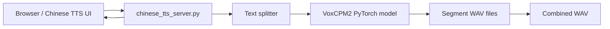

# DGX Spark VoxCPM2 Chinese TTS

這個專案是在 NVIDIA DGX Spark 上部署與評估 [OpenBMB/VoxCPM2](https://github.com/OpenBMB/VoxCPM) 的中文語音合成工具包。它包含兩個主要部分：

- `benchmark_voxcpm.py`: VoxCPM2 benchmark harness，用來測試載入時間、生成時間、音訊長度與 RTF。
- `chinese_tts_server.py` + `chinese-tts-web/`: 一個跑在 DGX Spark 上的中文 TTS Web UI，可以輸入中文、選擇台灣華語風格、生成 wav 並直接播放。

目前實測部署目標是：

- Host: DGX Spark, `192.168.0.110`
- OS: Ubuntu 24.04 / aarch64
- GPU: NVIDIA GB10
- Driver/CUDA: driver 580.x, CUDA 13.0
- Model: `OpenBMB/VoxCPM2`

## 上游 TTS 的角色

本 repo 不包含也不重新訓練 TTS 模型。真正負責語音合成的是 OpenBMB 提供的 VoxCPM：

- Python runtime package: `voxcpm`
- Model weights: `OpenBMB/VoxCPM2`
- Upstream repo: <https://github.com/OpenBMB/VoxCPM>

本 repo 的角色是「SPARK 部署與產品化包裝」：

- 建立 SPARK 可用的 Python/FFmpeg/CUDA 執行環境。
- 下載 VoxCPM2 權重到本機 `pretrained_models/VoxCPM2`。
- 用 `voxcpm.VoxCPM.from_pretrained(...)` 載入模型。
- 提供 benchmark 腳本。
- 提供中文 Web UI。
- 處理長文切段、跨段固定聲線、音檔合併、播放清單。

也就是說，上游 VoxCPM 是 TTS engine；本 repo 是部署、測試與使用介面。

## 功能

- 中文文字轉語音，網頁直接播放。
- 預設台灣華語聲音描述，並可自訂聲音風格。
- 輸入字數即時計算。
- 超過單段字數時自動按整體文字與標點切分。
- 多段生成後自動合併成單一 `combined` wav。
- 保留每段 wav，方便檢查問題段落。
- 長文跨段固定聲線：第一段建立聲音錨點，後續段落用第一段 wav 作為 prompt，降低每段變成不同人聲的機率。
- benchmark 輸出 `summary.json`、`results.csv`、`results.jsonl` 與 wav。

## 架構原理



`chinese_tts_server.py` 使用 Python 標準庫 `ThreadingHTTPServer`，沒有額外 Web framework。它提供：

- `GET /chinese-tts/`: 前端頁面
- `GET /api/health`: 服務狀態
- `POST /api/tts`: 文字合成 API
- `GET /outputs/<file>.wav`: 生成音檔

TTS 流程：

1. 前端送出中文、聲音描述、CFG、steps 等參數。
2. 後端載入常駐 VoxCPM2 模型。
3. 若文字超過單段上限，依整體字數與中文標點分段。
4. 第一段使用聲音描述生成。
5. 後續段落在 `stable_voice=true` 時使用第一段 wav + 第一段文字作為 prompt。
6. 每段輸出獨立 wav。
7. 多段時用 `numpy` 串接並加入短暫 silence gap，產生 `combined` wav。
8. 前端預設播放 `combined` wav，並顯示各段音檔清單。

注意：我們曾嘗試以「斷行」作為硬切段，但效果很差，容易讓每段聽起來像不同人。因此目前換行只當空白，切段仍由整體字數與標點控制。

## 目錄

```text
.
├── benchmark_voxcpm.py
├── chinese_tts_server.py
├── chinese-tts-web/
│   └── index.html
├── prompts/
│   ├── baseline.jsonl
│   ├── clone.jsonl
│   └── voice_design.jsonl
├── scripts/
│   ├── check_env.sh
│   ├── setup_env.sh
│   └── run_baseline.sh
└── runs/                  # runtime outputs, do not commit
```

## SPARK 預安裝與環境準備

以下是為了讓 VoxCPM2 在 DGX Spark 上成功運作所做的一連串準備。這些步驟很重要，因為 SPARK 是 aarch64 + GB10 + CUDA 13，套件相容性比一般 x86 workstation 更容易卡住。

### 1. 檢查系統

```bash
cd ~/dgx-voxcpm-eval
bash scripts/check_env.sh | tee runs-env-check.txt
```

確認重點：

- `nvidia-smi` 能看到 NVIDIA GB10。
- Docker 可用。
- Python 版本為 3.12。
- CUDA driver 正常。

### 2. 安裝系統套件

至少需要 Python headers。這個不是基本 TTS 必需，但 `torch.compile` / Triton 編譯會需要，否則會出現：

```text
fatal error: Python.h: No such file or directory
```

安裝：

```bash
sudo apt-get update
sudo apt-get install -y python3.12-dev
```

若系統尚未有基本編譯工具，也建議：

```bash
sudo apt-get install -y build-essential python3.12-venv
```

### 3. 建立 Python venv

```bash
cd ~/dgx-voxcpm-eval
python3 -m venv .venv
source .venv/bin/activate
python -m pip install -U pip setuptools wheel
```

我們曾遇到舊版 pip metadata/JSON 解析問題，因此必要時可用官方 `get-pip.py` 升級 pip。

### 4. 安裝 Python 套件

```bash
source .venv/bin/activate
python -m pip install -U torch torchaudio torchcodec
python -m pip install -U voxcpm soundfile pandas numpy modelscope
```

這裡的 `voxcpm` 就是上游 TTS Python 套件。安裝後程式可使用：

```python
from voxcpm import VoxCPM
model = VoxCPM.from_pretrained("pretrained_models/VoxCPM2")
```

本 repo 沒有 vendoring `voxcpm` 原始碼；預設從 Python package index 安裝。若未來要固定版本，可把指令改成：

```bash
python -m pip install 'voxcpm==2.0.3'
```

實測可用組合：

- `torch 2.12.0+cu130`
- `torchaudio 2.11.0+cu130`
- `torchcodec 0.13.0+cu130`
- `voxcpm 2.0.3`

確認：

```bash
python - <<'PY'
import torch
print("torch:", torch.__version__)
print("cuda:", torch.cuda.is_available())
print("device:", torch.cuda.get_device_name(0))
PY
```

### 5. 解決 FFmpeg / torchcodec shared library

`torchcodec` 需要 FFmpeg shared libraries。SPARK 上如果缺 `libavformat.so.*`、`libavutil.so.*`，會導致 import 或音訊處理失敗。

我們使用 conda-forge FFmpeg：

```bash
~/miniconda3/bin/conda create -n voxcpm_ffmpeg -y -c conda-forge ffmpeg
```

每次執行服務或 benchmark 前設定：

```bash
export LD_LIBRARY_PATH=/home/funsteam/miniconda3/envs/voxcpm_ffmpeg/lib
```

確認：

```bash
source .venv/bin/activate
export LD_LIBRARY_PATH=/home/funsteam/miniconda3/envs/voxcpm_ffmpeg/lib
python - <<'PY'
import torch, torchaudio, torchcodec, voxcpm, soundfile, pandas
print("ok")
PY
```

### 6. 下載模型

Hugging Face 下載在本次環境中速度不穩，因此改用 ModelScope：

```bash
source .venv/bin/activate
python - <<'PY'
from modelscope import snapshot_download
snapshot_download("OpenBMB/VoxCPM2", local_dir="pretrained_models/VoxCPM2")
PY
```

這一步只下載模型權重與 tokenizer，不安裝 Python 套件。Python 套件由上一節的 `pip install voxcpm` 提供。

下載完成後約 4.7 GB，目錄：

```text
pretrained_models/VoxCPM2/
├── audiovae.pth
├── config.json
├── model.safetensors
├── tokenizer.json
└── ...
```

## 啟動中文 TTS Web UI

```bash
cd ~/dgx-voxcpm-eval
source .venv/bin/activate
export LD_LIBRARY_PATH=/home/funsteam/miniconda3/envs/voxcpm_ffmpeg/lib
setsid .venv/bin/python chinese_tts_server.py > chinese-tts-server.log 2>&1 < /dev/null &
```

開啟：

```text
http://192.168.0.110:8792/chinese-tts/
```

Health check：

```bash
curl http://127.0.0.1:8792/api/health
```

### 中文 TTS Web UI 使用方式

開啟：

```text
http://<spark-ip>:8792/chinese-tts/
```

頁面欄位：

- `文字`: 輸入要合成的中文。右上角會顯示目前字數與單段上限。
- `聲音風格`: 選擇預設聲音描述，例如台灣腔自然、台灣女聲、台灣男聲、台灣新聞。
- `自訂描述`: 選擇「自訂描述」後可輸入任意聲音描述，例如「自然的台灣華語口音，語氣像台北日常對話，避免中國普通話腔」。
- `CFG`: VoxCPM guidance 參數，預設 `2.0`。
- `Steps`: 推論步數，預設 `10`。降低 steps 可加快速度，但可能影響音質。
- `長文跨段固定聲線`: 預設開啟。長文切段時，後續段落會用第一段 wav 作為 prompt，降低不同段落變成不同人聲的機率。

輸出區：

- 單段文字會直接播放該段 wav。
- 超過單段上限時，後端會依整體字數與標點自動切段。
- 多段輸出會產生各段 wav，並自動合併成一個 `combined` wav。
- 頁面預設播放「完整合併版」。
- 下方播放清單仍可切換到單段音檔，方便檢查問題段落。

如果頁面更新後仍看到舊功能，請用 `Ctrl + F5` 強制刷新。後端已設定 `Cache-Control: no-store`，但瀏覽器仍可能保留舊的 localStorage 歷史項目。舊歷史項目沒有 `combined_url` 時，請重新生成。

可用環境變數：

```bash
VOXCPM_MODEL=pretrained_models/VoxCPM2
VOXCPM_HOST=0.0.0.0
VOXCPM_PORT=8792
VOXCPM_MAX_TEXT_CHARS=420
```

## Benchmark 結果聽測面板

除了即時中文 TTS Web UI，本專案也設計了一個 benchmark 結果聽測面板，用來播放與比較 `runs/` 裡的測試音檔。

面板檔案：

```text
voxcpm-test-panel/index.html
```

部署到 SPARK 時，建議放在：

```text
~/dgx-voxcpm-eval/voxcpm-test-panel/index.html
```

並從專案根目錄啟動靜態 HTTP server，讓頁面能讀到 `runs/` 裡的 wav：

```bash
cd ~/dgx-voxcpm-eval
python3 -m http.server 8791 --bind 0.0.0.0
```

開啟：

```text
http://<spark-ip>:8791/voxcpm-test-panel/
```

功能：

- 切換不同 benchmark 組別，例如 Baseline、Voice Design、Clone、Opt 對照組。
- 播放每個 case 產生的 wav。
- 顯示 RTF、耗時、音長、字數。
- 搜尋 id 或文字。
- 對音檔做 1-5 分主觀評分。
- 撰寫聽感筆記，存在瀏覽器 localStorage。
- 預設只看乾淨 UTF-8 測試結果，避免舊亂碼 prompt 影響判斷。

這個面板不負責生成語音，只負責聽測 benchmark 輸出。即時生成請使用 `http://<spark-ip>:8792/chinese-tts/`。

## TTS API

```bash
curl -X POST http://127.0.0.1:8792/api/tts \
  -H 'Content-Type: application/json' \
  -d '{
    "text": "歡迎使用 DGX Spark 上的中文語音合成服務。",
    "voice": "自然的台灣華語口音，語氣親切，發音清楚",
    "cfg_value": 2.0,
    "inference_timesteps": 10,
    "stable_voice": true
  }'
```

回傳重點：

- `url`: 預設播放音檔。多段時為合併後 wav。
- `combined_url`: 合併後 wav。
- `segments`: 每段 wav 的 URL 與 RTF。
- `segment_count`: 段數。
- `rtf`: real-time factor。

## Benchmark

Baseline：

```bash
cd ~/dgx-voxcpm-eval
source .venv/bin/activate
export LD_LIBRARY_PATH=/home/funsteam/miniconda3/envs/voxcpm_ffmpeg/lib
python benchmark_voxcpm.py \
  --model pretrained_models/VoxCPM2 \
  --output-dir runs/baseline-local-utf8 \
  --prompts prompts/baseline.jsonl \
  --no-denoiser \
  --no-optimize
```

Voice design：

```bash
python benchmark_voxcpm.py \
  --model pretrained_models/VoxCPM2 \
  --output-dir runs/voice-design-local-utf8 \
  --prompts prompts/voice_design.jsonl \
  --no-denoiser \
  --no-optimize
```

Self-reference clone path：

```bash
python benchmark_voxcpm.py \
  --model pretrained_models/VoxCPM2 \
  --output-dir runs/clone-selfref-utf8 \
  --prompts prompts/clone.jsonl \
  --no-denoiser \
  --no-optimize \
  --prompt-wav runs/baseline-local-utf8/audio/zh_short_01_r1.wav \
  --prompt-text '你好，這是一段在 DGX Spark 上執行的中文語音合成測試。'
```

## 實測結果

在 DGX Spark / GB10 上，`optimize=False` 反而比較穩、比較快。

| 測試組 | no-optimize 平均 RTF | optimize 平均 RTF |
|---|---:|---:|
| Baseline UTF-8 | 1.1576 | 1.5146 |
| Voice Design | 1.3171 | 1.5176 |
| Clone Self-ref | 1.6654 | 1.6086 |

因此目前服務採用：

```python
VoxCPM.from_pretrained(..., load_denoiser=False, optimize=False)
```

`torch.compile` 可以在補齊 `python3.12-dev` 後跑起來，但在本機 GB10/aarch64 環境沒有加速效果。

## 加速方向與限制

觀察到的瓶頸主要在 GPU 推論，而不是 CPU。因此把每段文字平行丟給多個 CPU thread 不一定會變快，反而可能造成：

- 多段同時搶同一張 GPU。
- 聲線不穩定。
- CUDA graph / torch.compile 與 multi-threading 衝突。

目前採用的穩定策略：

- 單模型常駐。
- 單請求內按字數分段。
- 跨段以第一段作為聲線錨點。
- 最後合併 wav。

官方文件與 repo 討論指出，高吞吐 serving 更應考慮：

- NanoVLLM-VoxCPM
- vLLM-Omni
- streaming / continuous batching

但這些方案在 DGX Spark aarch64 + GB10 上仍需另行驗證。

## 常見問題

### 中文或 prompt 變成亂碼

請確認檔案為 UTF-8。舊版 prompt 曾因 Windows 編碼問題變亂碼，現在 `prompts/*.jsonl` 已重建為乾淨 UTF-8。

### `torchcodec` 找不到 FFmpeg

設定：

```bash
export LD_LIBRARY_PATH=/home/funsteam/miniconda3/envs/voxcpm_ffmpeg/lib
```

### `Python.h: No such file or directory`

安裝：

```bash
sudo apt-get install -y python3.12-dev
```

### 網頁更新後還看到舊功能

瀏覽器可能快取舊 JS。按 `Ctrl + F5` 強制刷新。後端已加 `Cache-Control: no-store`。

### 長文分段後人聲不同

保持 `長文跨段固定聲線` 開啟。它會用第一段 wav 作為後續段落 prompt。這能降低差異，但 VoxCPM2 仍不是絕對 deterministic。

## Repo 注意事項

- 不要 commit `runs/`、`pretrained_models/`、`.venv/`、`*.log`。
- 不要 commit `.ssh/` 或任何私鑰。
- 模型檔很大，應由 README 指示下載，不放進 repo。
